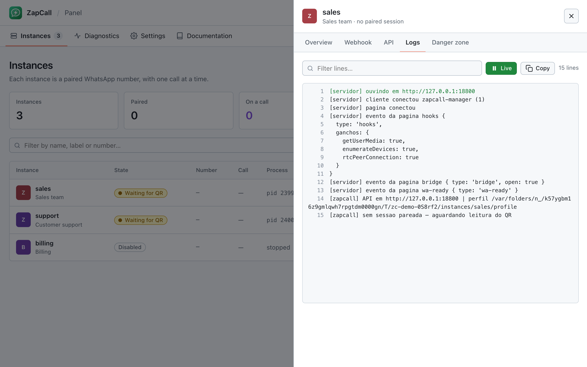
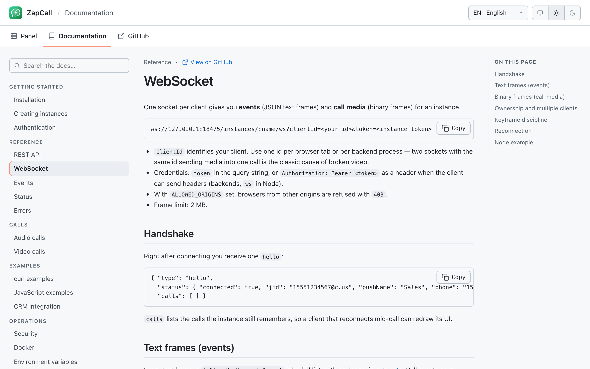

# ZapCall

**Voice and video calls over WhatsApp, as an API.** ZapCall runs the official WhatsApp Web inside a controlled Chrome and exposes an HTTP + WebSocket interface to place, answer, reject and end calls — with raw call audio and video flowing through the same socket — plus messages, contacts and webhooks in the Evolution API format. Many numbers, one service.

[](https://github.com/usermontalvao/ZapCall/actions/workflows/ci.yml)
[](LICENSE)
[](package.json)
[](docs/)

[Português](README.pt-BR.md) · [Español](README.es.md)

> **Status: experimental.** Real voice and video calls work today. Return media depends on private WhatsApp Web interfaces that Meta can change without notice, and automating WhatsApp Web is against its terms of service. Use a number you can afford to lose and read [Limitations](#limitations) before relying on it in production.

## Table of contents

- [Overview](#overview)
- [Features](#features)
- [Architecture](#architecture)
- [Quick start](#quick-start)
- [Docker](#docker)
- [API at a glance](#api-at-a-glance)
- [Documentation](#documentation)
- [Security](#security)
- [Screenshots](#screenshots)
- [Development](#development)
- [Contributing](#contributing)
- [Limitations](#limitations)
- [License](#license)

## Overview

| | |
|---|---|
| **Instances** | One paired WhatsApp number per instance, each in its own Chrome process, profile and port. A single manager supervises them all. |
| **Calls** | `POST /call/offer` → `callId` → events (`incoming_call`, `call_active`, `call_ended`…) and media on one WebSocket. One call per instance, enforced with `409 channel_busy`. |
| **Media** | Open format: PCM 16 kHz mono (60 ms frames) and H.264 Annex-B with a 4-byte header. Play it, record it, transcribe it, forward it. |
| **Messages** | `/message/*`, `/chat/*`, `/webhook/*` with Evolution / Baileys payloads — existing integrations reuse their handlers. |
| **Panel** | Built-in administration UI: instances, pairing by QR, live call state, webhooks, logs, diagnostics, self-tests. PT / EN / ES, light / dark. |
| **Docs** | Full manual served by the service itself at `/docs`, in three languages, no external site required. |

## Features

- Voice and video calls, inbound and outbound, with mute and a reference dialer (`/instances/:name/dialer`).
- Multiple instances with independent tokens; a global key for administration.
- Webhooks with retries, WebSocket with reconnection-friendly `hello` handshake.
- Automatic restart of crashed Chrome processes with back-off; orphan cleanup; parent-death watchdog.
- Security by default: loopback bind, constant-time credential checks, brute-force limiter, `Referrer-Policy: no-referrer`, CSP without CDNs, origin allow-list, secrets never printed in full.
- Diagnostics: per-instance self-test, media counters, Chrome footprint, live logs.

## Architecture

```
                 ┌──────────────────────────── ZapCall manager (:18475) ────────────────────────────┐
  your backend   │  panel · docs · /instance/* · /call/* · /message/* · /webhook/* · /instances/:n/ws │
  or browser ───▶│                                                                                    │
                 │   proxy ──▶ instance "sales"   (127.0.0.1:18500) ──▶ Chrome ──▶ WhatsApp Web      │
                 │   proxy ──▶ instance "support" (127.0.0.1:18501) ──▶ Chrome ──▶ WhatsApp Web      │
                 └────────────────────────────────────────────────────────────────────────────────────┘
```

Each instance is `src/app.mjs`: an HTTP/WS server (`src/server.mjs`) plus a Chrome driven by `puppeteer-core` (`src/browser.mjs`). Scripts injected into the WhatsApp Web page (`src/page/`) replace the microphone and camera with virtual devices fed by your media, capture the contact's audio/video, and drive calls through WA-JS. The manager (`src/manager.mjs`) owns the registry, tokens, proxying, webhooks and the one-call-per-instance rule. Details: [docs/ARCHITECTURE.md](docs/ARCHITECTURE.md).

## Quick start

Requirements: Node.js ≥ 22.12 and Google Chrome (not a distro Chromium — video needs its H.264 codec).

```bash
git clone https://github.com/usermontalvao/ZapCall && cd ZapCall
npm install
npm start
```

1. Open `http://127.0.0.1:18475/` and sign in with the global key (`ZAPCALL_API_KEY`, or the one generated into `data/manager.json` on first boot — the log shows only a masked version).
2. **New instance** → name it → **Pair** → scan the QR with the phone (*WhatsApp › Linked devices › Link a device*).
3. Open the instance's **API** tab: it shows the instance token and ready-made `curl` commands.

## Docker

```bash
cp .env.example .env      # set ZAPCALL_API_KEY, DEFAULT_COUNTRY_CODE, ALLOWED_ORIGINS as needed
docker compose up -d
docker compose logs -f zapcall
```

The image is `linux/amd64` only and uses host networking with the service bound to `127.0.0.1`. Paired sessions live in the `zapcall_data` volume. See [docs/en/docker.md](docs/en/docker.md) for reverse proxies and TLS.

## API at a glance

```bash
# create an instance (global key) → its token is hash.apikey
curl -X POST http://127.0.0.1:18475/instance/create \
  -H "apikey: GLOBAL_KEY" -H "Content-Type: application/json" \
  -d '{"instanceName":"sales","webhook":"https://example.com/zapcall"}'

# pairing QR (base64 PNG + terminal art)
curl http://127.0.0.1:18475/instance/connect/sales -H "apikey: INSTANCE_TOKEN"

# place a call
curl -X POST http://127.0.0.1:18475/call/offer/sales \
  -H "apikey: INSTANCE_TOKEN" -H "x-client-id: my-backend" -H "Content-Type: application/json" \
  -d '{"number":"15551234567","isVideo":false}'
# → {"callId":"…"}   or   409 {"error":"channel_busy","call":{…}}

# events + media
ws://127.0.0.1:18475/instances/sales/ws?clientId=my-backend&token=INSTANCE_TOKEN
```

| Route family | Purpose |
|---|---|
| `/instance/*` | create, list, connect (QR), state, update, token rotation, restart, logout, delete |
| `/call/*` | offer, accept, reject, hangup, mute, status |
| `/message/*`, `/chat/*` | text, media, audio, stickers, contacts, reactions, presence, profile, history |
| `/webhook/*` | per-instance webhook with delivery log |
| `/instances/:name/ws` | events (JSON) and call media (binary) |
| `/manager/*` | what the panel uses: instances, logs, QR, system, self-tests |

## Documentation

Served by the running service at **`/docs`** (PT / EN / ES, searchable) and kept as Markdown in [`docs/`](docs/): installation, instances, authentication, REST API, WebSocket, events, status, errors, audio calls, video calls, curl and JavaScript examples, CRM integration, security, Docker, environment variables.

## Security

Read [SECURITY.md](SECURITY.md) for the threat model, built-in controls, your responsibilities and how to report a vulnerability. Short version: keep instance tokens in your backend, keep `DATA_DIR` private, terminate TLS in front, and never expose the service beyond the loopback without an authenticated proxy.

## Screenshots

<table>
  <tr>
    <td align="center"><br><sub>Instances</sub></td>
    <td align="center"><br><sub>Pairing by QR</sub></td>
  </tr>
  <tr>
    <td align="center"><br><sub>Live logs</sub></td>
    <td align="center"><br><sub>Built-in documentation</sub></td>
  </tr>
</table>

## Development

```bash
npm run check   # syntax check of every module
npm test        # unit + integration tests; the dialer end-to-end test needs Chrome and is skipped without it
npm run probe   # media self-test in a real Chrome, no WhatsApp session required
```

Project layout:

```
src/manager.mjs      manager: registry, proxy, webhooks, panel and docs routes
src/app.mjs          one instance: wires server + browser, watches pairing and the parent process
src/server.mjs       instance HTTP/WS API, media routing, call state
src/browser.mjs      Chrome lifecycle and script injection
src/security.mjs     constant-time compare, limiter, headers, origin rules
src/page/            scripts injected into WhatsApp Web + the panel, docs, dialer and pairing pages
docs/                Markdown documentation (pt / en / es) served at /docs
test/                node:test suites (unit, integration, headless-Chrome end-to-end)
```

## Contributing

Issues and pull requests are welcome — see [CONTRIBUTING.md](CONTRIBUTING.md). Please run `npm run check && npm test` before opening a PR, keep the panel and the docs in all three languages, and never include tokens, QR codes or session data in reports.

## Limitations

- **One call per instance** — a WhatsApp Web rule. Parallelism means more instances (each takes one of the four linked-device slots of a number).
- **The phone also rings** on incoming calls; whoever answers first keeps the call (`accepted_elsewhere` elsewhere).
- **Return media relies on private WhatsApp Web modules.** A WhatsApp update may break it; the symptom is a connected but silent call with `nativeMedia.ready = false` in `/api/diag`.
- **Not a multi-tenant API.** An instance token grants everything on that instance; per-user authorization belongs in your backend.
- **Terms of service.** Automating WhatsApp Web violates Meta's terms; numbers can be banned.

## License

[MIT](LICENSE). ZapCall is not affiliated with, endorsed by, or connected to WhatsApp LLC or Meta Platforms, Inc.
