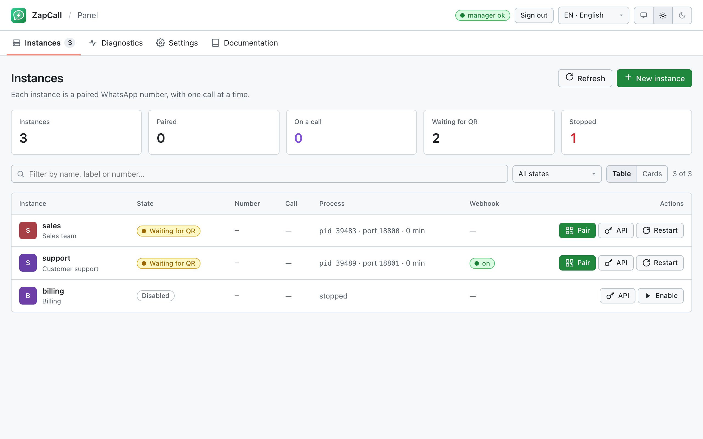
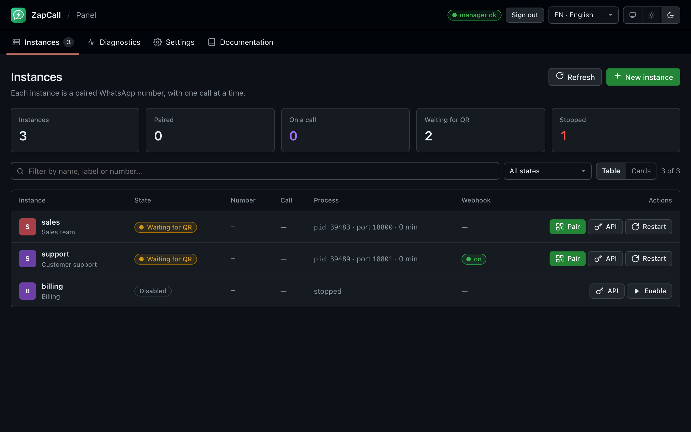
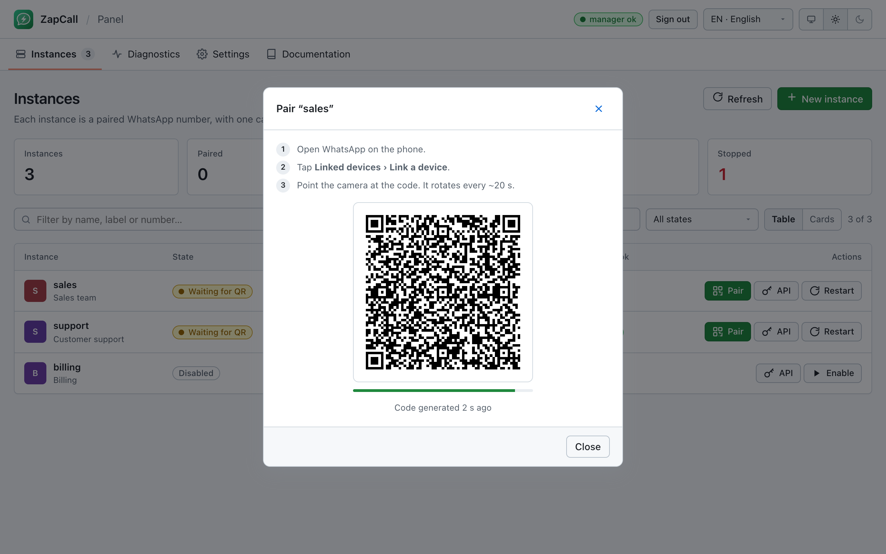
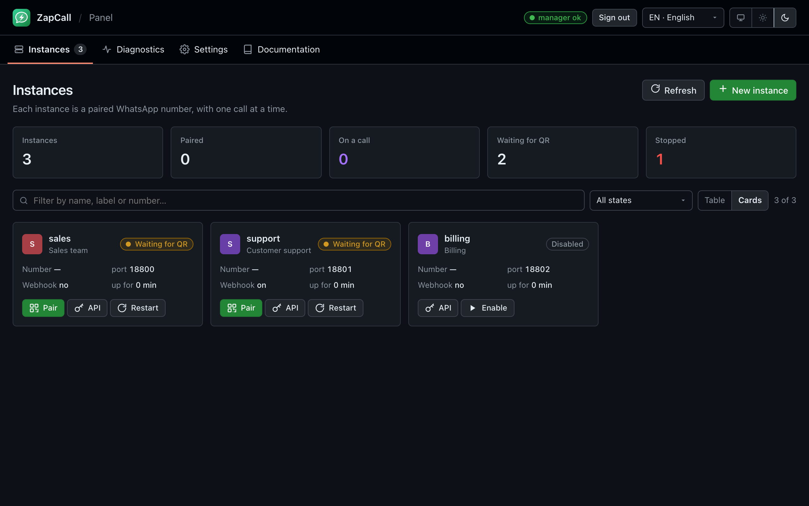
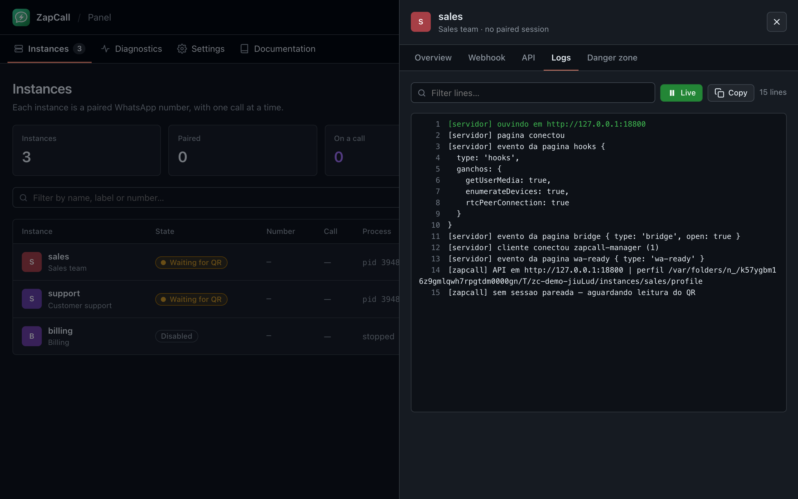
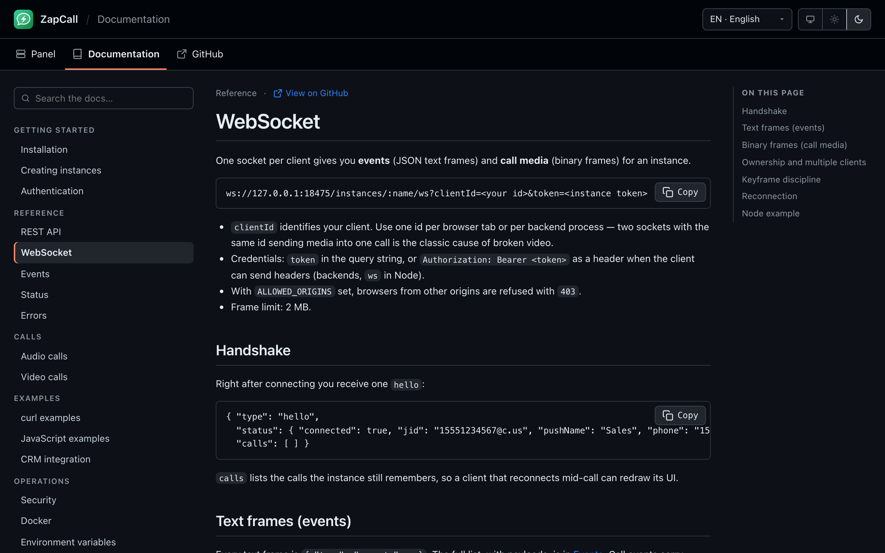

# ZapCall

**Chamadas de voz e vídeo pelo WhatsApp, por API.**

O ZapCall transforma um número do WhatsApp numa linha telefônica programável. Ele roda o WhatsApp Web oficial dentro de um Chrome controlado e expõe uma interface HTTP + WebSocket para ligar, atender, recusar e desligar — com o áudio e o vídeo crus da chamada trafegando pelo mesmo socket, para o seu sistema tocar para um atendente, gravar, transcrever ou encaminhar — além de mensagens, contatos e webhooks no formato da Evolution API. Vários números, um serviço só, sem contrato de WhatsApp Business API.

Feito para CRMs, help desks e centrais de atendimento que já falam com o cliente pelo WhatsApp e querem as chamadas no mesmo lugar da conversa: clicar para ligar na ficha do cliente, chamada recebida tocando no atendente certo, gravação anexada ao ticket.

[](https://github.com/usermontalvao/ZapCall/actions/workflows/ci.yml)
[](LICENSE)
[](package.json)
[](docs/)

[](https://mpago.la/1sba1dw)
[](SUPPORTERS.md)

[English](README.md) · [Español](README.es.md)

> ☕ **O ZapCall é gratuito e independente.** Não há empresa por trás nem plano pago. Se ele substituiu um contrato de chamadas por minuto ou te poupou uma semana de engenharia reversa, [pague um café para a equipe](#apoie-o-projeto) — cada café paga os números de teste e as chamadas reais que rodam toda noite para o projeto continuar funcionando depois de cada atualização do WhatsApp. Quem apoia aparece em [SUPPORTERS.md](SUPPORTERS.md).

> **Status: experimental.** Chamadas reais de voz e vídeo funcionam hoje. A mídia de retorno depende de interfaces privadas do WhatsApp Web que a Meta pode mudar sem aviso, e automatizar o WhatsApp Web contraria os termos de uso. Use um número que você pode perder e leia [Limitações](#limitações) antes de depender disto em produção.

## Visão geral

| | |
|---|---|
| **Instâncias** | Um número do WhatsApp pareado por instância, cada uma no próprio processo do Chrome, perfil e porta. Um único gerente supervisiona todas. |
| **Chamadas** | `POST /call/offer` → `callId` → eventos (`incoming_call`, `call_active`, `call_ended`…) e mídia num WebSocket só. Uma chamada por instância, imposta com `409 channel_busy`. |
| **Mídia** | Formato aberto: PCM 16 kHz mono (quadros de 60 ms) e H.264 Annex-B com cabeçalho de 4 bytes. Toque, grave, transcreva, encaminhe. |
| **Mensagens** | `/message/*`, `/chat/*`, `/webhook/*` com corpos Evolution / Baileys — integrações existentes reaproveitam os handlers. |
| **Painel** | UI de administração embutida: instâncias, pareamento por QR, estado da chamada ao vivo, webhooks, logs, diagnóstico, autotestes. PT / EN / ES, claro / escuro. |
| **Documentação** | Manual completo servido pelo próprio serviço em `/docs`, em três idiomas, sem site externo. |

## Início rápido

Requisitos: Node.js ≥ 22.12 e Google Chrome (não o Chromium da distribuição — o vídeo precisa do codec H.264 dele).

```bash
git clone https://github.com/usermontalvao/ZapCall && cd ZapCall
npm install
npm start
```

1. Abra `http://127.0.0.1:18475/` e entre com a chave global (`ZAPCALL_API_KEY`, ou a gerada em `data/manager.json` no primeiro boot — o log mostra só uma versão mascarada).
2. **Nova instância** → dê um nome → **Parear** → leia o QR com o celular (*WhatsApp › Dispositivos conectados › Conectar dispositivo*).
3. Abra a aba **API** da instância: ela mostra o token e os comandos `curl` prontos.

## Docker

```bash
cp .env.example .env      # defina ZAPCALL_API_KEY, DEFAULT_COUNTRY_CODE, ALLOWED_ORIGINS conforme precisar
docker compose up -d
docker compose logs -f zapcall
```

A imagem é só `linux/amd64` e usa rede de host com o serviço preso a `127.0.0.1`. As sessões pareadas vivem no volume `zapcall_data`. Veja [docs/pt/docker.md](docs/pt/docker.md) para proxy reverso e TLS.

## A API em um minuto

```bash
# criar uma instância (chave global) → o token dela é hash.apikey
curl -X POST http://127.0.0.1:18475/instance/create \
  -H "apikey: CHAVE_GLOBAL" -H "Content-Type: application/json" \
  -d '{"instanceName":"vendas","webhook":"https://exemplo.com/zapcall"}'

# QR de pareamento (PNG base64 + arte de terminal)
curl http://127.0.0.1:18475/instance/connect/vendas -H "apikey: TOKEN_DA_INSTANCIA"

# ligar
curl -X POST http://127.0.0.1:18475/call/offer/vendas \
  -H "apikey: TOKEN_DA_INSTANCIA" -H "x-client-id: meu-backend" -H "Content-Type: application/json" \
  -d '{"number":"5511999999999","isVideo":false}'
# → {"callId":"…"}   ou   409 {"error":"channel_busy","call":{…}}

# eventos + mídia
ws://127.0.0.1:18475/instances/vendas/ws?clientId=meu-backend&token=TOKEN_DA_INSTANCIA
```

## Documentação

Servida pelo serviço em **`/docs`** (PT / EN / ES, com busca) e mantida em Markdown em [`docs/`](docs/): instalação, instâncias, autenticação, API REST, WebSocket, eventos, status, erros, chamadas de áudio, chamadas de vídeo, exemplos com curl e JavaScript, integração com CRM, segurança, Docker, variáveis de ambiente.

## Screenshots

O painel segue o tema do sistema (claro / escuro) e fala português, inglês e espanhol.

<table>
  <tr>
    <td align="center"><br><sub>Instâncias — claro</sub></td>
    <td align="center"><br><sub>Instâncias — escuro</sub></td>
  </tr>
  <tr>
    <td align="center"><br><sub>Pareamento por QR</sub></td>
    <td align="center"><br><sub>Cartões — escuro</sub></td>
  </tr>
  <tr>
    <td align="center"><br><sub>Logs ao vivo — escuro</sub></td>
    <td align="center"><br><sub>Documentação embutida — escuro</sub></td>
  </tr>
</table>

## Segurança

Leia [SECURITY.md](SECURITY.md): modelo de ameaça, controles embutidos, suas responsabilidades e como relatar uma vulnerabilidade. Resumo: tokens de instância ficam no backend, `DATA_DIR` é privado, TLS termina na frente e o serviço nunca sai do loopback sem um proxy autenticado.

## Desenvolvimento

```bash
npm run check   # verificação de sintaxe de todos os módulos
npm test        # testes unitários e de integração; o teste ponta a ponta do discador precisa do Chrome e é pulado sem ele
npm run probe   # autoteste de mídia num Chrome real, sem sessão do WhatsApp
```

Arquitetura e organização dos arquivos: [docs/ARCHITECTURE.md](docs/ARCHITECTURE.md). Contribuições: [CONTRIBUTING.md](CONTRIBUTING.md).

## Roadmap

Planejado, mais ou menos nesta ordem. Abra uma issue para votar ou propor outra coisa.

- [ ] **Gravação embutida** — `record: true` na chamada grava um WAV (estéreo: atendente / contato) em `DATA_DIR` e avisa no `call_ended`.
- [ ] **Ganchos de transcrição** — enviar o áudio da chamada a um serviço de transcrição e entregar o texto como evento.
- [ ] **Tokens com escopo** — credenciais por atendente com permissões (discar, atender, ouvir, mensagens), para navegadores conectarem sem o token da instância.
- [ ] **Upgrade para vídeo no meio da chamada** — sem desligar (hoje `501`).
- [ ] **Transferência de chamada** entre instâncias e transferência assistida entre dois atendentes.
- [ ] **Especificação OpenAPI** e SDKs oficiais (Node.js, Python).
- [ ] **Endpoint de métricas** (`/metrics`, Prometheus) — chamadas, durações, taxa de quadros, memória do Chrome.
- [ ] **Usuários e papéis no painel** — vários administradores, log de auditoria, leitores.
- [ ] **Modelos de mensagem e respostas rápidas** no painel.
- [ ] **Mais idiomas** no painel e na documentação (contribuições bem-vindas — veja [CONTRIBUTING.md](CONTRIBUTING.md#adding-a-language)).
- [ ] **Helm chart** e imagem ARM64 (depende de um Chrome com H.264 para Linux arm64).

## Apoie o projeto

O ZapCall é gratuito e vai continuar gratuito — MIT, sem plano pago, sem empresa por trás. O que ele *custa* é real: o WhatsApp muda o cliente web a cada poucas semanas e cada mudança pode emudecer todas as chamadas; manter o ZapCall funcionando exige números de teste, um servidor que faz chamadas reais toda noite e horas lendo código minificado. Uma API comercial de chamadas pelo WhatsApp cobra por minuto; aqui você paga o que achar justo, uma vez, e todo mundo aproveita.

**O que o seu café banca**

| | Valor | Paga |
|:---:|:---:|---|
| ☕ | [**R$ 50 — um café**](https://mpago.la/1sba1dw) | Um número de teste por um mês, para pareamento e chamadas serem verificados num celular de verdade. |
| ☕☕ | [**R$ 200 — café grande**](https://mpago.la/1Lkup75) | Um mês do servidor que faz as chamadas reais de voz e vídeo toda noite e pega as atualizações do WhatsApp antes de você. |
| ☕☕☕ | [**R$ 1.000 — um mês de café**](https://mpago.la/22kZeoS) | Uma semana inteira de trabalho no [roadmap](#roadmap) — gravação, tokens com escopo, transcrição — com o seu nome nas notas da versão. |

O pagamento é pelo Mercado Pago (cartão, Pix ou boleto). Todo apoiador, em qualquer valor, entra no [mural de apoiadores](SUPPORTERS.md) — abra um pull request com o seu nome ou usuário, ou escreva na mensagem do pagamento.

**Formas de ajudar que não custam nada:** dar uma estrela no repositório (é assim que outros desenvolvedores o encontram), relatar um bug com os logs da instância, traduzir uma página da documentação, ou contar para alguém que ainda paga por chamada.

## Limitações

- **Uma chamada por instância** — regra do WhatsApp Web. Paralelismo = mais instâncias (cada uma usa uma das quatro vagas de dispositivo conectado do número).
- **O celular também toca** nas chamadas recebidas; quem atender primeiro fica com a chamada (`accepted_elsewhere` nos outros).
- **A mídia de retorno depende de módulos privados do WhatsApp Web.** Uma atualização pode quebrá-la; o sintoma é chamada conectada e muda com `nativeMedia.ready = false` em `/api/diag`.
- **Não é uma API multiusuário.** Um token de instância dá tudo naquela instância; autorização por usuário é do seu backend.
- **Termos de uso.** Automatizar o WhatsApp Web viola os termos da Meta; números podem ser banidos.

## Licença

[MIT](LICENSE). O ZapCall não é afiliado, endossado ou ligado ao WhatsApp LLC ou à Meta Platforms, Inc.
